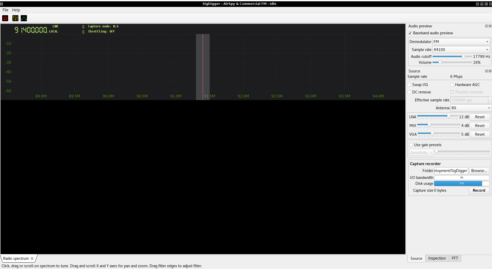

# SigDigger - The free digital signal analyzer
_Now for Qt and C++14!_


SigDigger is the continuation project for the already-deprecated Suscan. GTK+3.0 ended up falling short (especially in terms of performance) and exposing Suscan's API to C++ paid off. 

The set of features is more or less the same, with few things missing (like estimators, the FAC analysis or the Berlekamp-Massey algorithm... working on it, still trying to figure out the UI) and a lot of additions, like a realtime audio inspector, sample recorder, realtime 6Msps channel inspection (AirSpy tested), LSE-based SNR calculator or gain presents. I tried to make it as customizable as Suscan, but I'm still a Qt newbie, so expect bugs!

 

## Wait, why does it look like Gqrx?
Because I'm a terrible person. Also, because after dealing with a lot of software of the sort, I realized that Gqrx had the best UI of them all: minimalistic and yet operative. Earlier versions of the UI were somewhat different, but after a lot of debugging I came to the conclusion that it would be better off if I just tried to mimic existing (and successful) software, reducing the learning curve to the new feature set.

You may notice that the spectrum widget looks a lot like Gqrx's. This is because the specturm widget is actually Gqrx's with minimal modifications (like support for configurable Waterfall pallettes). I tried to code my own Waterfall widget in Suscan and Xorg ended up hogging the CPU, so I'm not reinventing the wheel anymore: I decided to extend the existing Gqrx's Plotter widget so it fits SigDigger's set of features.

Apart from the UI layout and the plotter wigets, SigDigger bears little resemblance to Gqrx: Gqrx depends on GnuRadio, while SigDigger is a Qt5 frontend for Suscan. The DSP chains are totally different and Suscan's thread model is optimized for a very specific set of tasks.

## How am I supposed to compile this?
SigDigger depends on three different projects: **Sigutils**, **Suscan** and **SuWidgets**. You need to build and install these projects in your computer prior to compile SigDigger.

* Sigutils build instructions can be found [here](https://github.com/BatchDrake/sigutils/blob/master/README.md).
* Suscan build instructions can be found [here](https://github.com/BatchDrake/suscan/blob/master/README.md). You will sill need GTK+ 3.0 for this. I have plans to remove the whole GTK UI from this project in the near future.


After successfully building Sigutils and Suscan, you can now proceed to build **SuWidgets**. SuWidgets is Qt 5.11 graphical library containing all SigDigger's custom widgets. In order to build it, ensure you have the latest version of the Qt 5.11 development framework installed in your system and then run:

```
% git clone https://github.com/BatchDrake/SuWidgets
% cd SuWidgets
% qmake SuWidgetsLib.pro
% make
% sudo make install
```

If you the above steps were successful, chances are that you will success on building SigDigger too. In order to build SigDigger, do:

```
% git clone https://github.com/BatchDrake/SigDigger
% cd SigDigger
% qmake SigDigger.pro
% make
% sudo make install
```

And, in order to run SigDigger, just type:

```
% SigDigger
```

If the command above fails, it is possible that you got SigDigger installed somewhere else, like /opt/SigDigger. In that case, you can try to run instead:

```
% /opt/SigDigger/bin/SigDigger
```

## Precompiled releases
You can find precompiled releases under the "Releases" tab in this repository. For the time being, these releases are meant for x64 Linux only (preferably Debian-like distributions) and have been minimally tested. Although I have plans to port Sigutils, Suscan and SigDigger to other platforms, I'd like to have a stable codebase before going any further.

Obviously, your feedback will make my job easier. If you experience any issues building or using SigDigger, go ahead and use the fantastic GitHub's bug tracking system. It works pretty well and it is way easier for me to keep track of the existing issues.

Looking forward for your feedback! :)

---
73 de EA1IYR
